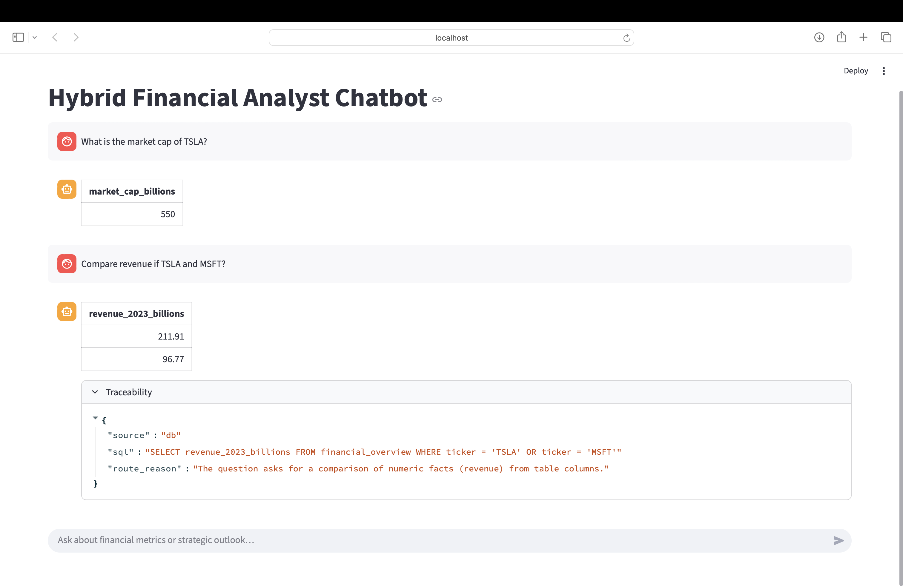

# HYBRID-ANALYST-BOT

A hybrid analyst assistant that routes questions to:
- **DuckDB (SQL)** for structured financial metrics from `data/financial_data.csv`
- **RAG over PDFs (ChromaDB)** for qualitative questions from company documents in `docs/`

The app is built with Streamlit and includes a **Traceability** panel showing:
- route decision (SQL vs PDF)
- generated SQL query (for DB questions)
- document citations (source + page) for RAG answers

---

## 1. Setup

### 1.1 Prerequisites
- Python **3.11+** (recommended 3.11)
- A Groq API key (for LLM calls)

### 1.2 Create and activate venv
```bash
python3 -m venv venv
source venv/bin/activate
python --version
```

### 1.3 Install dependencies
```bash
pip install --upgrade pip
pip install -r requirements.txt
```

### 1.4 Environment variables
```bash
GROQ_API_KEY=your_api_key_here
GROQ_BASE_URL=https://api.groq.com/openai/v1
GROQ_MODEL=llama-3.3-70b-versatile
```

### 1.5 Build RAG index
```bash
python build_rag.py
```

### 1.6 Run Streamlit Application
```bash
streamlit run app.py
```

### 1.7 Optional test commands
```bash
python test_env.py
python test_llm.py
python test_db.py
python test_retrieve.py
python test_rag_answer.py
python test_agent.py
```

## 2. Architecture

### 2.1 High-level Flow

1. The user submits a question via the **Streamlit UI**.
2. `agent.py` orchestrates the end-to-end flow:
   - Resolves follow-up questions using conversational memory (`memory.py`)
   - Determines the appropriate execution route using a prompt-based router (`router.py`)

3. Based on the routing decision:

   **SQL Path**
   - `db_sql_agent.py` generates a safe, read-only `SELECT` query
   - `db.py` executes the query against an in-memory DuckDB table

   **RAG Path**
   - `rag.py` retrieves the most relevant document chunks from ChromaDB
   - `rag_answer.py` generates a grounded answer using retrieved chunks and includes citations

4. The UI renders:
   - The final answer
   - A traceability section showing:
     - Chosen route (SQL or RAG)
     - SQL query (for database answers)
     - Source documents and page numbers (for RAG answers)
     - Reason for the routing decision

### 2.2 Routing Logic

The system uses an LLM-based prompt router to classify each user query into one of two execution paths:

- **SQL**: For structured, numeric, or tabular questions (e.g., market cap, revenue, comparisons).
- **RAG**: For qualitative, descriptive, or narrative questions that require contextual understanding from documents (e.g., strategy, initiatives, growth drivers).

The router returns a strict JSON object indicating:
- The selected route (`SQL` or `RAG`)
- A short explanation for why the route was chosen

This routing decision is surfaced in the UI under the **Traceability** section, ensuring transparency and debuggability.

### 2.3 Safety & Guardrails

Several guardrails are implemented to ensure correctness and safety:

- **SQL Safety**
  - Only `SELECT` queries are permitted
  - Mutating statements (`INSERT`, `UPDATE`, `DELETE`, etc.) are explicitly blocked
  - Queries are validated against the known schema before execution

- **RAG Grounding**
  - Answers must be grounded in retrieved document chunks
  - Each answer includes explicit citations with document source and page number
  - If no relevant evidence is found, the system explicitly states this rather than hallucinating

- **Traceability**
  - Every answer includes metadata describing:
    - The execution route
    - The SQL query used (if applicable)
    - The source documents and pages used for grounding

---

## 3. Assumptions

The following assumptions were made during implementation:

- Financial data is small enough to fit comfortably in an in-memory DuckDB table
- The `ticker` field is the canonical identifier for companies
- User questions are well-formed English queries
- PDF documents contain qualitative and contextual information not present in the structured table
- Follow-up questions rely on lightweight conversational memory (e.g., last referenced company)

---

## 4. Demo

### Example SQL Query

**Question:**  
> What is the market cap of TSLA?

**Behavior:**  
- Routed to SQL
- Query executed against DuckDB
- Result returned with the exact SQL shown in Traceability

---

### Example RAG Query

**Question:**  
> What are the AI initiatives mentioned by Microsoft?

**Behavior:**  
- Routed to RAG
- Relevant chunks retrieved from `docs/MSFT.pdf`
- Answer generated with citations including document name and page number

---

### Demo Screenshot



## 5. Repository Structure

```plaintext

.
├── app.py
├── build_rag.py
├── data/
│ └── financial_data.csv
├── docs/
│ └── .pdf
├── src/
│ ├── agent.py
│ ├── config.py
│ ├── db.py
│ ├── db_sql_agent.py
│ ├── llm.py
│ ├── memory.py
│ ├── rag.py
│ ├── rag_answer.py
│ ├── router.py
│ └── schemas.py
├── requirements.txt
├── README.md
└── test_.py

```

